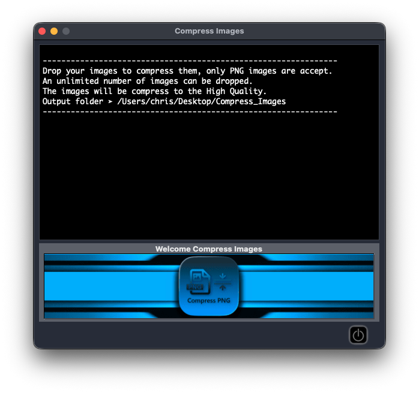
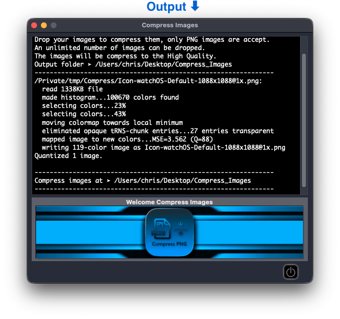

# Compress PNG
[](https://github.com/chris1111/Compress-PNG/blob/main/LICENSE)


### Compress PNG is a free Open source macOS Applications to compress PNG images.


Credit: [chris1111](https://github.com/chris1111), [pngquant](https://github.com/kornelski/pngquant), [platypus](https://github.com/sveinbjornt/Platypus)

### The conversion reduces file sizes significantly (often as much as 70%) and preserves full alpha transparency. Generated images are compatible with all web browsers and operating systems.

# Features
- High-quality palette generation using a combination of vector quantization algorithms.
- Unique adaptive dithering algorithm that adds less noise to images than the standard Floyd-Steinberg.
- Easy to integrate with shell scripts, GUIs and server-side software.
- Fast mode for real-time processing/large numbers of images.


## Download Release ➤ [Compress PNG](https://github.com/chris1111/Compress-PNG/releases/tag/V1)

### Build App from command in macOS
```
git clone https://github.com/chris1111/Compress-PNG.git && cd $HOME/Compress-PNG && mkdir -p ./"Compress PNG.app" && cp -rp ./Source/Contents ./"Compress PNG.app" && Open -R ./"Compress PNG.app"
```




